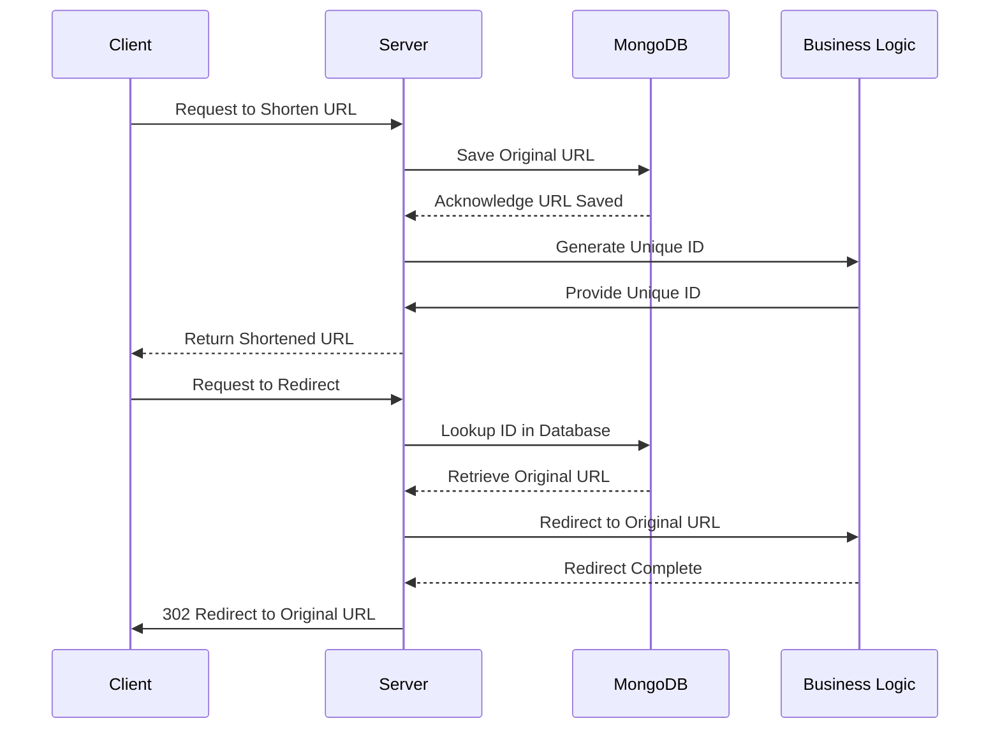

# Short URL

This projects helps you shorten long url to short. Now project link itself is long as I use free domain😁, but later I will invest it(I mean new domain, better server and etc). [Link to the project](https://beamish-valkyrie-00af98.netlify.app/)

## Table of Contents

- [HOW IT WORKS?](#how-it-works)
- [Project Overview](#project-overview)
- [Folder Structure](#folder-structure)
- [Getting Started](#getting-started)
- [Contributing](#contributing)
- [License](#license)

## Project Overview

The URL Shortening Project is a web application designed to provide a convenient and efficient way to shorten long and cumbersome URLs. This service offers users the ability to convert lengthy web addresses into compact and manageable links, making it easier to share and remember.

### Key Features

- **URL Shortening**: Users can submit long URLs, and the system will generate unique, shortened URLs for them.

- **Redirection**: Shortened URLs created by the system can be used to redirect users to the original long URLs when accessed.

- **Database Storage**: Original URLs and their corresponding shortened versions are stored in a MongoDB database.

- **Client-Server Architecture**: The project consists of two main components: the client, built with ReactJS, and the server, implemented in Node.js. This client-server architecture ensures efficient URL shortening and redirection.

- **Contributions Welcome**: This project is open to contributions from the community. Whether it's reporting issues, suggesting enhancements, or submitting pull requests, we encourage active participation.

### How shortening works

1. **URL Shortening**: Users input long URLs through the client, which sends a request to the server. The server saves the long URL in a MongoDB database, generates a unique identifier, and returns the shortened URL to the client.

2. **URL Redirection**: When someone accesses a shortened URL, the client sends a request to the server with the shortened ID. The server looks up the ID in the database, retrieves the corresponding long URL, and performs a 302 redirection to the original URL, directing the user to the intended web page.

This project aims to simplify the process of sharing and managing URLs while allowing for easy contributions and customization. Whether you want to use it as a standalone service or integrate it into your applications, the URL Shortening Project offers a versatile solution.

## Folder Structure

Here's the folder structure of the project:

```markdown
├── client
│ ├── dist
│ │ src ├── \*_/_.tsx
│ ├── redux
│ ├── .env (production)
│ ├── .env.local (development)
│ ├── other files...
├── server
│ ├── controllers
│ ├── db
│ ├── middlewares
│ ├── models
│ ├── .env.production (production)
│ ├── .env (development)
│ ├── other files...
├── .gitignore
├── global.scss
├── README.md
```

Pay attention to **environment** files to run project easily in development.

## Getting Started

To start the project, follow these steps:

#### Clone the repository

    git clone git@github.com:IkboljonMe/short-url.git

#### Install client dependencies

    cd client
    npm install

#### Install server dependencies

    cd server
    npm install

#### Make sure you have correct .env files

Both client and server has development and production .env variables. Before starting project, make sure you have put correct variables as shown in **.env.example** file. Check - [Folder Structure](#folder-structure) for better understand.

#### Start the client

    cd client
    npm run dev

#### Start the server

    cd yserver
    npm start

## Contributing

Contributions to this project are welcome! If you'd like to contribute, please follow these guidelines:

1. **Issues:** If you find a bug or have a suggestion, please [open an issue](https://github.com/IkboljonMe/short-url#short-url/issues) to discuss it.

2. **Pull Requests:** To contribute code or documentation, submit a pull request to the [GitHub repository](https://github.com/IkboljonMe/short-url#short-url).

3. **Coding Standards:** Ensure that your code follows the project's coding standards and conventions. If any guidelines or specific practices are required, mention them in the pull request description.

4. **Documentation:** Update the documentation, including the README file, if your changes impact how the project is used.

Thank you for your contributions to this project!

## License

This project is licensed under the MIT License - see the [LICENSE](https://github.com/IkboljonMe/short-url/blob/main/LICENSE.txt) file for details. You are free to use, modify, and distribute this project in accordance with the terms of the MIT License.

## How it works

This UML interaction diagram describes the URL shortening and redirection process of my project


